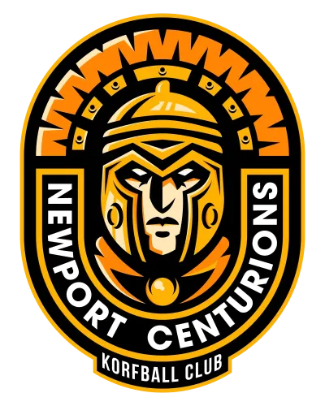



    <!-- Hero: Bold headline + stats strip -->
    <section class="hero-section">
        <picture class="logo-modern">
            <source srcset="images/newport-centurions-korfball-club-400.webp 400w, images/newport-centurions-korfball-club-800.webp 800w" sizes="(max-width: 768px) 80vw, 300px" type="image/webp">
            
        </picture>
        <h1 class="hero-headline" itemprop="name">Play Mixed-Gender Korfball in Newport</h1>
        
South Wales' premier korfball club. Beginners welcome.

        

            
{{ site.data.club.members }}Members

            

            
{{ site.data.club.teams }}Teams

            

            
{{ site.data.club.titles_count }}×Champions

        

    </section>

    <!-- Training + Social grid -->
    

        <section class="training-info glass-morphism">
            <h2>Next Training</h2>
            

                
                

                    <strong>{{ session.day }}s</strong> — {{ session.display }}
                

                
            

            
{{ site.data.club.venue.name }}, {{ site.data.club.venue.locality }}

            <a href="{{ site.data.club.venue.maps_url }}" target="_blank" rel="noopener noreferrer" class="modern-button">Get Directions</a>
        </section>

        <section class="social-section">
            <h2 class="follow-header" id="follow-us">Connect With Us</h2>
            <nav class="social-links" aria-label="Social Media Links">
                
                <a href="{{ link.url }}" class="social-link" aria-label="Follow us on {{ link.name }}" rel="noopener noreferrer" target="_blank"><i class="fab {{ link.icon }}" aria-hidden="true"></i></a>
                
            </nav>
        </section>
    

